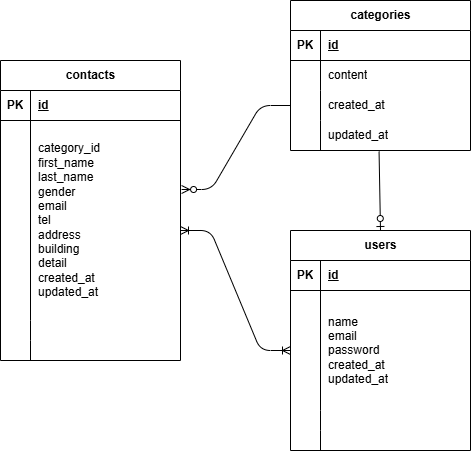

# laravel-docker-template
アプリケーション名
お問い合わせフォーム

環境構築
Dookerビルド
1.git clone リンク
2.docker-compose up -d --build

Laravel環境構築
1.docker-compose exec php bash
2.composer install
3.env.exampleファイルから.envを作成し環境変数を変更
4.php artisan key:generate
5.php artisan migrate
6.php artisan db:seed

使用技術
・PHP　8.0
・Laravel 10.0
・MYSQL 8.0

ER図

URL
・開発環境：http://localhost:8081/
・phpMyAdmin:http://localhost:8080/